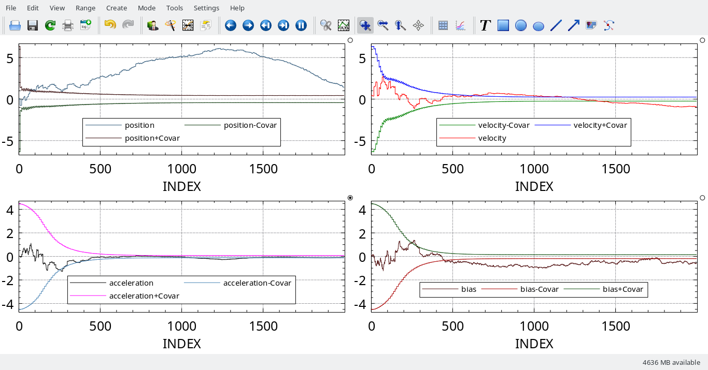

# Jerk car
This is an example of a 4 dimensional state estimated via a Vanilla Kalman filter and an Information Filter, and writing the estimates and covariances to a CSV file (different for each filter).

This example also shows how straight forward it is to use this package.

*Note*: this example comes from the second midterm of Dr. Ahmed's ASEN 5044 at CU Boulder.

# Example graph
## Vanilla Kalman Filter
This plot uses the data from `vanilla.csv`, so feel free to inspect that.

Note that the position is not correctly estimated.

## Information Filter
This plot uses the data from `information.csv`, so feel free to inspect that.

